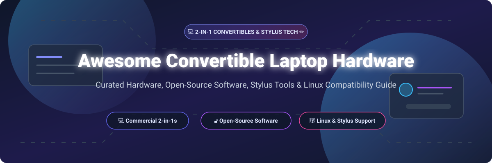

# 💻 Awesome Convertible Laptop Hardware & Software Ecosystem ✏️

  
  
  
  
  
  
  

A comprehensive, SEO-optimized, curated guide to **2-in-1 convertible laptops**, **stylus note-taking applications**, **commercial SaaS productivity suites**, and **open-source Linux compatibility tools**. 

Whether you are a student, researcher, digital artist, or software developer using devices like the Microsoft Surface, HP Spectre x360, or Lenovo Yoga, this repository provides data on hardware specs, software pricing, Linux driver support, and open-source projects to maximize your stylus and touchscreen workflow.

---

## 📖 Table of Contents

- [💡 Overview](#-overview)
- [☁️ Commercial SaaS Productivity Suites](#️-commercial-saas-productivity-suites)
- [💻 Commercial Convertible Hardware](#-commercial-convertible-hardware)
- [🔓 Open-Source Software Projects](#-open-source-software-projects)
- [🤝 How to Contribute](#-how-to-contribute)
- [💖 Support & Sponsorship](#-support--sponsorship)
- [⭐ Star History](#-star-history)
- [⚠️ Disclaimer](#%EF%B8%8F-disclaimer)

---

## 💡 Overview

Convertible 2-in-1 laptops combine the processing power of traditional ultrabooks with the flexibility of tablet displays and active styluses (MPP, AES, Wacom, Apple Pencil equivalent technology). While hardware is produced by major OEMs, operating system and application support varies significantly across Windows, macOS, and Linux distributions.

This repository tracks both commercial hardware/SaaS solutions and open-source applications (such as Xournal++, Rnote, Krita, and Saber) that deliver handwriting recognition, vector note-taking, PDF annotation, and touch drivers.

---

## ☁️ Commercial SaaS Productivity Suites

> **📊 Market Context**: The global digital note-taking and stylus productivity SaaS market is estimated at **~$7.5B in 2026**, projected to reach **~$16B by 2032** at a **~13% CAGR**. The sector is **moderately concentrated**, anchored by tech giants like Microsoft alongside specialized software developers like Bending Spoons (Evernote), Notion Labs, Goodnotes, and MyScript.

| Product & Link | Description | Pricing (Starting Tier) | Free Tier Limits / Free Trial | Company Size / Valuation |
|---|---|---|---|---|
| **[Microsoft 365 / OneNote](https://www.microsoft.com/en-us/microsoft-365/onenote)** | **Universal digital notebook & cloud suite.** Native stylus handwriting, ink-to-text conversion, audio recording, and cross-platform sync. | **$6.99/mo** (Microsoft 365 Personal) | **Free version included** with Microsoft account (5GB OneDrive storage limit, core note-taking features). | **~$245B annual revenue** |
| **[Notion](https://www.notion.so)** | **All-in-one workspace.** Notes, wikis, databases, Kanban boards, and AI handwriting/text search integration. | **$10/user/mo** (Plus plan billed annually) | **Free forever plan** for individuals (unlimited pages & blocks, 5MB file upload limit, up to 10 block guests). | **~$10B valuation** (~$300M+ ARR) |
| **[Evernote](https://evernote.com)** | **Cross-platform note-taking & PDF scanner.** Real-time syncing, optical character recognition (OCR) for handwritten notes. | **$14.99/mo** (Evernote Personal) | **Free forever plan** (limited to 1 notebook, 50 notes total, 60MB monthly uploads, max 25MB note size). | **~$2.55B valuation** (Bending Spoons) / ~$100M+ ARR |
| **[Goodnotes](https://www.goodnotes.com)** | **Vector-based digital note-taking & PDF annotation.** AI handwriting assist, ink gestures, math conversion. | **$9.99/year** or **$29.99** one-time purchase | **Free plan available** (allows up to 3 notebooks with full editing tools and basic pen selection). | **~$50M+ ARR** (Private) |
| **[Nebo](https://www.nebo.app)** | **Interactive ink & handwriting recognition.** Converts handwritten notes to typed text, math equations, and diagrams. | **$8.99** (One-time full app unlock) | **Free plan available** (allows 1 notebook with up to 5 pages of full interactive handwriting feature testing). | **~$30M+ revenue** (MyScript parent) |
| **[Concepts](https://concepts.app)** | **Flexible vector sketching & infinite canvas.** Precision drawing, infinite canvas, coplanar layers, CAD export. | **$4.99/mo** or **$29.99/year** (Everything Plan) | **Free forever plan** (infinite canvas, vector brush engine, 5 layers, basic canvas exports). | **~$10M+ valuation** (Private) |

---

## 💻 Commercial Convertible Hardware

> **📊 Market Context**: The global 2-in-1 convertible laptop market is estimated at **~$25B in 2026**, growing toward **~$50B by 2032** at a **~12% CAGR**. The hardware sector is **moderately concentrated** — Lenovo and HP lead on volume, while Microsoft, Samsung, and Dell compete in the premium tier. Linux compatibility varies dramatically by vendor and component.

| Hardware Model | Description | Pricing (Starting Tier) | Linux & Open-Source Support | Company Size / Revenue |
|---|---|---|---|---|
| **[Microsoft Surface Laptop Studio](https://www.microsoft.com/en-us/surface/devices/surface-laptop-studio)** | **Versatile convertible with dynamic woven hinge.** 14.4" PixelSense Flow 120Hz display, Intel Core H-series, NVIDIA RTX graphics. | **$1,599** (Core i5, 16GB RAM, 256GB SSD) | **Community-supported** via `linux-surface` kernel project. Touchscreen, pen, and keyboard work with kernel patches. | **~$281B annual revenue** |
| **[Samsung Galaxy Book3 Pro 360](https://www.samsung.com/us/computing/galaxy-books/galaxy-book3-pro-360/)** | **Ultra-slim convertible with AMOLED display.** 16" 3K AMOLED, Intel Core i7, included low-latency S Pen. | **$1,449** (Core i7, 16GB RAM, 512GB SSD) | **Partial support**. Touchscreen and S Pen work out of the box; fingerprint sensor requires proprietary drivers. | **~$250B annual revenue** |
| **[Dell XPS 13 2-in-1](https://www.dell.com/en-us/shop/dell-laptops/xps-13-2-in-1-laptop/spd/xps-13-9315-2-in-1-laptop)** | **Compact 2-in-1 with premium aluminum chassis.** 13" 3K2K touch display, Intel Core Ultra, optional Dell Active Pen. | **$1,299** (Core Ultra 5, 16GB RAM, 512GB SSD) | **Good support**. Wi-Fi, Bluetooth, touchscreen, and stylus function properly on Ubuntu & Fedora. | **~$100B annual revenue** |
| **[HP Spectre x360](https://www.hp.com/us-en/shop/slp/spectre-x360)** | **Premium 2-in-1 with 360° gem-cut design.** 13.5" or 16" OLED options, Intel Core Ultra, included HP MPP 2.0 pen. | **$1,449** (13.5" Core Ultra 5, 16GB RAM, 512GB SSD) | **ArchWiki documented**. Touchscreen, touchpad, and audio work out-of-the-box on kernel 6.x+. | **~$60B annual revenue** |
| **[Lenovo Yoga 9i](https://www.lenovo.com/us/en/p/laptops/yoga/yoga-9-series/lenovo-yoga-9i-2-in-1-gen-9-14-inch-intel/len101y0008)** | **Flagship convertible with rotating soundbar.** 14" 2.8K OLED, Intel Core Ultra, included Lenovo Precision Pen. | **$1,449** (Core Ultra 7, 16GB RAM, 512GB SSD) | **Community repo available**. Bluetooth firmware workarounds documented for Linux 6.8+. | **~$60B annual revenue** |
| **[Lenovo ThinkPad X1 Yoga](https://www.lenovo.com/us/en/p/laptops/thinkpad/thinkpadyoga/thinkpad-x1-yoga-gen-9-14-inch-intel/len101t0091)** | **Business-class convertible with durable chassis.** 14" 2.8K OLED, Intel Core Ultra, included ThinkPad Pen Pro. | **$1,749** (Core Ultra 7, 16GB RAM, 512GB SSD) | **Excellent Linux support**. Official Lenovo Linux certification; full kernel driver integration. | **~$60B annual revenue** |
| **[LG Gram 16 2-in-1](https://www.lg.com/us/laptops/lg-16t90r-k.apc7u1)** | **Ultra-lightweight 16-inch convertible.** 16" WQXGA touch display, Intel Core i7, Wacom AES 2.0 stylus pen. Weighs 3.26 lbs. | **$1,599** (Core i7, 16GB RAM, 512GB SSD) | **Partial support**. Touchscreen and stylus function well; battery threshold tweaks require ACPI configuration. | **~$60B annual revenue** |
| **[ASUS Zenbook Flip](https://www.asus.com/laptops/for-home/zenbook/zenbook-flip-14-ux3402/)** | **Sleek convertible with ErgoLift 360° hinge.** 14" 2.8K OLED display, Intel Core Ultra, included ASUS Pen 2.0. | **$1,099** (Core Ultra 5, 16GB RAM, 512GB SSD) | **Good support**. Key features work out of the box on modern Linux distros. | **~$20B annual revenue** |
| **[MSI Summit E16 Flip](https://www.msi.com/Business-Productivity/Summit-E16-Flip-A13V)** | **16-inch business convertible.** QHD+ 165Hz display, Intel Core i7, included MSI Pen MPP 2.0. | **$1,499** (Core i7, 16GB RAM, 1TB SSD) | **Partial support**. Touchscreen functions smoothly; tablet mode sensor requires `iio-sensor-proxy`. | **~$20B annual revenue** |

---

## 🔓 Open-Source Software Projects

Sorted by GitHub star count descending. Click on any star badge to visit the stargazers page for that project.

| Project Name | Description & Features | Stargazers Badge |
|---|---|---|
| **[Krita](https://github.com/KDE/krita)** | **Professional open-source raster graphics & digital painting suite.** Full stylus pressure sensitivity, tablet calibration, brush engines, layer management, animation tools, and touchscreen gestures. |  |
| **[Xournal++](https://github.com/xournalpp/xournalpp)** | **The standard for handwritten notes and PDF annotation on Linux.** Written in C++. Native pressure-sensitive pen support (Wacom, Huion, XP-Pen), PDF markup, LaTeX equation rendering, geometry tools, and custom grid backgrounds. |  |
| **[Rnote](https://github.com/flxzt/rnote)** | **Modern GTK4 vector-based sketching and handwriting app.** Infinite canvas, continuous pages, pressure-sensitive drawing, shape recognition, PDF/SVG export. Designed specifically for Linux tablet PCs. |  |
| **[linux-surface](https://github.com/linux-surface/linux-surface)** | **Linux kernel drivers and patches for Microsoft Surface devices.** Enables touchscreen, stylus pen pressure/buttons, IPTS/ITHC camera drivers, battery status, and detachable keyboard dock support. |  |
| **[Saber](https://github.com/saber-notes/saber)** | **Fast, local-first handwritten notes app with Markdown integration.** Cross-platform Flutter app with local encryption, stylus note-taking, dark mode, PDF export, and seamless sync across Linux, Windows, Android, and iOS. |  |
| **[Linwood Butterfly](https://github.com/LinwoodCloud/Butterfly)** | **Cross-platform, minimalistic infinite canvas note-taking application.** Supports stylus input, WebDAV synchronization, background templates, and export to PDF/SVG/PNG. |  |
| **[Stylus Labs Write](https://github.com/styluslabs/write)** | **Minimalist stroke-based vector note-taking tool.** Features non-linear editing, document reflow, customized page layouts, and low-latency pen ink engine. |  |
| **[Lorien](https://github.com/mbrlabs/Lorien)** | **Infinite canvas drawing and note-taking app built with Godot.** Stores strokes as collection of points rather than raster bitmap; ultra lightweight, fast, and cross-platform. |  |
| **[Drawpile](https://github.com/drawpile/Drawpile)** | **Collaborative open-source drawing program.** Allows multiple artists to sketch on the same canvas simultaneously with pressure-sensitive stylus input over local network or server. |  |
| **[MyPaint](https://github.com/mypaint/mypaint)** | **Nimble open-source graphics application for digital painters.** Pressure-sensitive pen support, procedural brush engine, infinite canvas, and simple user interface for convertible tablets. |  |
| **[Scrivano](https://github.com/TeXlyre/Scrivano)** | **Handwriting and grid-based PDF note-taking application.** Features grid snapping, smart laser pointer, stroke eraser, and optimized Linux touchscreen UI. |  |
| **[Writernote](https://github.com/writernote/writernote)** | **Intelligent Markdown and stylus note-taking utility.** Lightweight canvas for quick handwritten notes, diagramming, and structured text editing. |  |

---

## 🤝 How to Contribute

Contributions are welcome! Please follow these guidelines:

1. **Fork the repository** on GitHub.
2. **Add or update entries** in `README.md` following the exact table structure.
3. Ensure hardware specifications, pricing, free tier limits, and GitHub star links are exact and factual.
4. Submit a **Pull Request** with a clear description of your changes.

For curated meta-lists, explore [Awesome Awesome Awesome](https://github.com/ishandutta2007/Awesome-Awesome-Awesome).

---

## 💖 Support & Sponsorship

If you find this repository helpful for selecting 2-in-1 convertible laptop hardware, configuring Linux drivers, or discovering stylus productivity tools, please consider supporting the project!

- ⭐ **Star this repository** to help others discover it.
- 🔀 **Fork & Share** with fellow Linux enthusiasts, digital note-takers, and tech communities.
- ☕ **Buy me a coffee / Sponsor**: Support ongoing maintenance via the [GitHub Sponsor Dashboard](https://github.com/sponsors/ishandutta2007).

Thank you for your support! ❤️

---

## ⭐ Star History

---

## ⚠️ Disclaimer

- This is a community-curated collection intended for informational purposes. Product specifications, SaaS pricing tiers, and vendor revenues are subject to change.
- Linux compatibility for commercial 2-in-1 convertibles depends heavily on kernel version, firmware modules, and active community projects. Always inspect ArchWiki or specialized hardware repos prior to making purchasing decisions.
